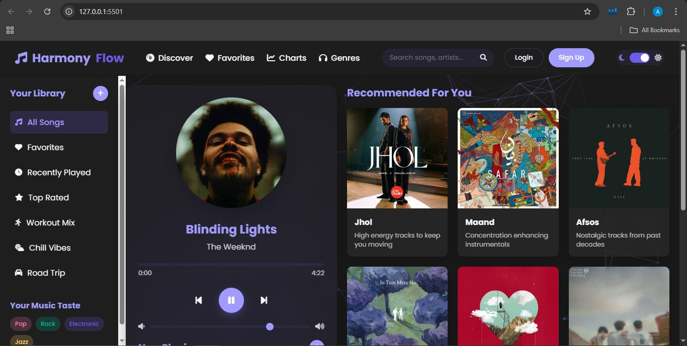

# 🎵 Music Player Web App  

A sleek, responsive music player built with **HTML, CSS, and JavaScript**. Perfect for playing your favorite tunes with intuitive controls!  

   

## 🎯 Features  
- **Play/Pause** – Simple playback controls  
- **Next/Previous Track** – Navigate songs seamlessly  
- **Progress Bar** – Seek through tracks  
- **Volume Control** – Adjust audio levels  
- **Dynamic Display** – Shows album art, song title, and artist  
- **Responsive Design** – Works on mobile and desktop  

## 🛠️ Technologies  
- **Frontend**: HTML5, CSS3, JavaScript  
- **Audio API**: `<audio>` element integration  
- **UI**: Custom animations and transitions  

## 🚀 Setup  
1. **Clone the repo**:  
   ```bash  
   git clone https://github.com/Ayesha-Emaan/Music-Player-Website.git  
Open index.html in your browser (no server needed!).

🎨 Customization
Replace music: Add MP3 files to /assets/songs and update metadata in js/script.js.

Change styling: Modify colors/fonts in css/style.css.

🌟 Live Demo
🔗 https://ayesha-emaan.github.io/Music-Player-Website/

📝 License
MIT © Ayesha Emaan
